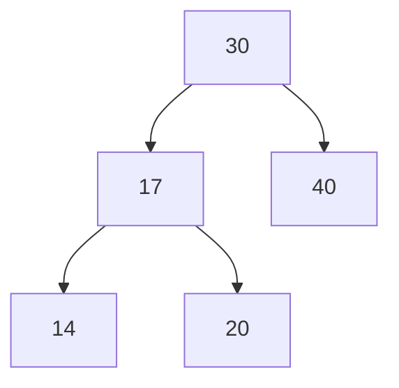
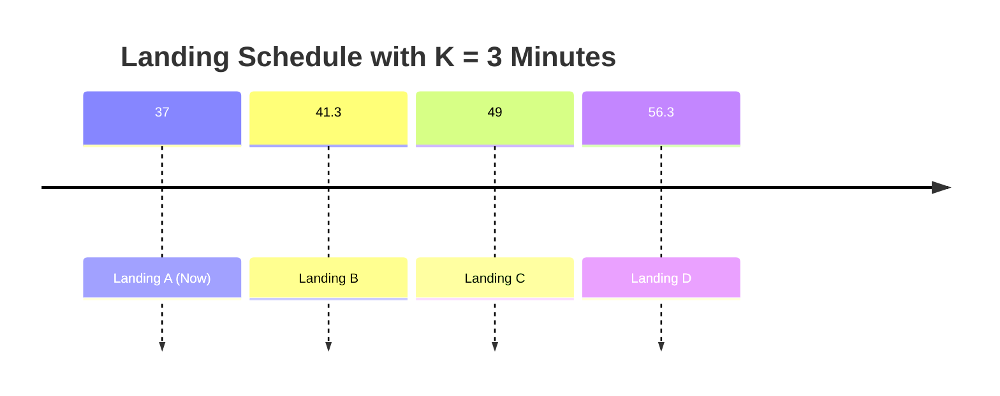

# Binary Search Tree

We know that a binary search is a divide and conquer paradigm. The data structure associated with it is *Binary Search Tree*.
Let's motivate this data structure with a problem, a scheduling problem: **A runway reservation system**.

## Runway Reservation System.

We manage a single-runway airport and need to process landing reservations over continuous time, represented by real values. The system must support the following operations:

- **Landing reservation**: Given a landing time \( t \), insert it into a set \( R \) of scheduled landings if no other landings are scheduled within \( K \) minutes of \( t \), where \( K \) is a configurable buffer time (e.g., \( K = 3 \) minutes).
- **Cleanup**: Remove a landing time from \( R \) once the corresponding landing has occurred.
- **Efficiency requirement**: All operations on \( R \) should be supported in \( O(\log N) \) time, where \( N = |R| \).

