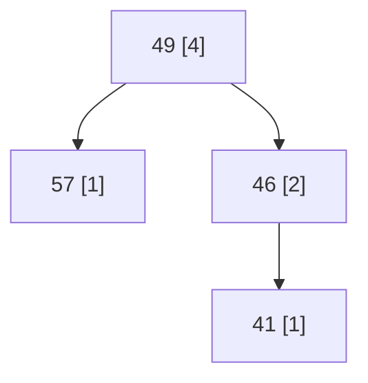

# Binary Search Tree

We know that a binary search is a divide and conquer paradigm. The data structure associated with it is *Binary Search Tree*.
Let's motivate this data structure with a problem, a scheduling problem: **A runway reservation system**.

## Runway Reservation System.

We manage a single-runway airport and need to process landing reservations over continuous time, represented by real values. The system must support the following operations:

- **Landing reservation**: Given a landing time \( t \), insert it into a set \( R \) of scheduled landings if no other landings are scheduled within \( K \) minutes of \( t \), where \( K \) is a configurable buffer time (e.g., \( K = 3 \) minutes).
- **Cleanup**: Remove a landing time from \( R \) once the corresponding landing has occurred.
- **Efficiency requirement**: All operations on \( R \) should be supported in \( O(\log N) \) time, where \( N = |R| \).


This diagram shows the new landing at **53** being successfully scheduled because:

- \( 53 - 49 = 4 > 3 \)
- \( 56.3 - 53 = 3.3 > 3 \)
So it satisfies the buffer requirement of \( K = 3 \) minutes on both sides.


Now we will have a new landing reqeust at **44** and this will be rejected 
because it is too close at 41.3 (only 2.7 minutes apart, which is less than K=3).


We want fast insertion and fast lookup, both in \( O(\log N) \) time.

**Invariant**: For all nodes `x` in the tree:
- If `y` is in the left subtree of `x`, then `key(y) <= key(x)`
- If `y` is in the right subtree of `x`, then `key(y) >= key(x)`


# BST Insertion: 49, 57, 46, 41

We insert the following numbers into a Binary Search Tree (BST):

**Values**: `49`, `57`, `46`, `41`

---

### Step 1: Insert `49`


---

### Step 2: Insert `57`

`57 > 49` → Insert to the **right** of `49`.


---

### Step 3: Insert `46`

`46 < 49` → Insert to the **left** of `49`.


---

### Step 4: Insert `41`

`41 < 49` → Go left to `46`  
`41 < 46` → Insert to the **left** of `46`


---

### ✅ Final BST Structure


Summarizing in a BST we have:

| Operation       | Time Complexity | Description                              |
|----------------|------------------|------------------------------------------|
| Insertion       | O(h) = O(log N)  | Insert a node based on BST rules         |
| find_min()      | O(h) = O(log N)  | Traverse to the leftmost node            |
| find_max()      | O(h) = O(log N)  | Traverse to the rightmost node           |
| next_item()     | O(h) = O(log N)  | Find in-order successor of a node        |


To solve our scheduling problem, we need to add an additional requirement to our Binary Search Tree: the ability to compute the rank of a node in order to answer the question:

*"How many planes are scheduled to land at or before a given time t?"*

# Augmented BST with `rank(t)` Support

We start with a Binary Search Tree (BST) and augment it to compute:

> **rank(t)**: Number of values in the BST that are ≤ `t`

---

## 🧠 Node Augmentation

Each node in the BST is augmented with a **size** field:

- `size = 1 + size(left) + size(right)`
- This represents the total number of nodes in the subtree rooted at that node

---

## 🌳 BST after inserting: `49, 57, 46, 41`

We insert the values in order and compute the `size` of each node.

### Final BST with `size` annotations:



---

## ✏️ `rank(t)` Algorithm

```python
def rank(node, t):
    if node is None:
        return 0
    if t < node.value:
        return rank(node.left, t)
    elif t == node.value:
        return size(node.left) + 1
    else:
        return size(node.left) + 1 + rank(node.right, t)
```

### Explanation:
- If `t < node.value`: only left subtree may contain values ≤ t
- If `t == node.value`: count left subtree + this node
- If `t > node.value`: count left + self + right subtree’s rank

---

## 🧪 Sample `rank(t)` Queries

| `t`   | `rank(t)` | Explanation                   |
|-------|-----------|-------------------------------|
| 40    | 0         | No values ≤ 40                |
| 41    | 1         | Only node 41                  |
| 46    | 2         | Nodes: 41, 46                 |
| 49    | 3         | Nodes: 41, 46, 49             |
| 57    | 4         | All nodes: 41, 46, 49, 57     |

---

## ✅ Summary

By augmenting each node with a `size`, we can compute `rank(t)` in **O(log n)** for balanced BSTs. This is useful for tracking scheduled planes, timestamps, or any other time-based rank queries. Using that we know where if the we can insert.

## Simple Problems with a BST.
### Diameter

Given the root a binary tree, find the diameter. **Diameter** of a binary tree is the maximum distance between two 
nodes: *the distance is measured by the number of edges between the nodes*.
The diameter of binary search tree will be the maximum of:
- the diameter of the left subtree
- the diameter of the right subtree
- the sum of the height of the left path and the height of the right path

Here the python version.

```python
class TreeNode:
    def __init__(self, val=0, left=None, right=None):
        self.val = val
        self.left = left
        self.right = right

def diameter_of_bst(root):
    def longest_path(node):
        if not node:
            return 0, 0  # (diameter, height)

        left_diameter, left_height = longest_path(node.left)
        right_diameter, right_height = longest_path(node.right)

        current_diameter = left_height + right_height
        max_diameter = max(left_diameter, right_diameter, current_diameter)
        current_height = max(left_height, right_height) + 1

        return max_diameter, current_height

    diameter, _ = longest_path(root)
    return diameter
```
Here the rust version:

```rust
use std::rc::Rc;
use std::cell::RefCell;

// Define the TreeNode
#[derive(Debug)]
struct TreeNode {
    val: i32,
    left: Option<Rc<RefCell<TreeNode>>>,
    right: Option<Rc<RefCell<TreeNode>>>,
}

// Helper type alias
type Node = Option<Rc<RefCell<TreeNode>>>;

fn diameter_of_bst(root: Node) -> i32 {
    fn helper(node: &Node) -> (i32, i32) {
        if let Some(n) = node {
            let n = n.borrow();
            let (left_dia, left_height) = helper(&n.left);
            let (right_dia, right_height) = helper(&n.right);

            let current_dia = left_height + right_height;
            let max_dia = left_dia.max(right_dia).max(current_dia);
            let height = 1 + left_height.max(right_height);

            (max_dia, height)
        } else {
            (0, 0)
        }
    }

    let (diameter, _) = helper(&root);
    diameter
}
```