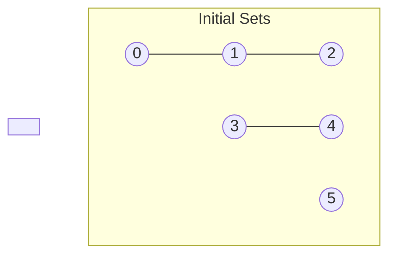

## Algorithm Design
1. Model the problem.
2. Find an algorithm to solve the problem.
3. Is the algorithm fast enough? Does it fits in memory?
4. If not, figure out why?
5. Find a way to address the problem
6. Iterate until satisfied.
It is kind of scientific method to solve it.

## Dynamic connectivity (Union-Find)
Problem: Given a set of N objects you have to:
1. *Union*: Connect two objects.
2. *Find/connected query* : is there a path connecting two objects?

