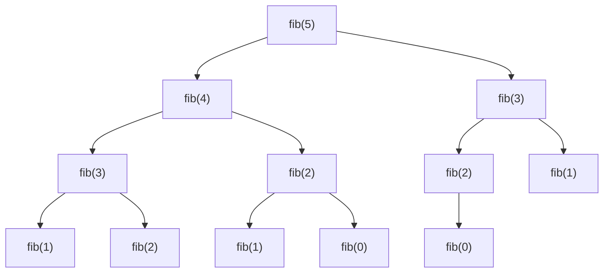
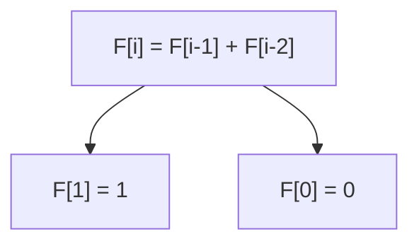

# 🧠 Dynamic Programming (DP)

Dynamic Programming is a technique for solving problems by **breaking them down into overlapping subproblems**, solving each subproblem **once**, and **storing** their results to avoid redundant work (also known as *memoization* or *tabulation*).

Naive recursive solutions often **recompute the same subproblem multiple times**. With DP, we **save the results** of those computations and **reuse** them, greatly improving performance.

## Common Types of DP Problems

1. **Counting problems** – e.g., number of ways to reach a target.
2. **Optimization problems** – e.g., find minimum or maximum value.
3. **Decision problems** – e.g., YES/NO type questions.

---

## ⚡ Kadane's Algorithm (Explained Simply)

Kadane's Algorithm is a famous **Dynamic Programming** algorithm used to find the **maximum subarray sum** in an array of integers.

### Idea

Keep track of two variables while iterating:

- `current_sum`: the max subarray sum **ending at current index**
- `max_sum`: the **maximum of all `current_sum` values** seen so far

```python
def kadane(arr):
    current_sum = max_sum = arr[0]
    for num in arr[1:]:
        current_sum = max(num, current_sum + num)
        max_sum = max(max_sum, current_sum)
    return max_sum
```

---

## 💡 Recursion vs Iteration in DP

| Feature                        | Recursion                                      | Iteration                                        |
|-------------------------------|-----------------------------------------------|--------------------------------------------------|
| **Ease of Implementation**     | Easier to write the naive/backtracking version | May require more planning in structure           |
| **State Management**           | Often fewer states needed                     | May require extra effort to manage state space   |
| **Order of Computation**       | Order doesn’t always matter                   | Order of filling DP table must be carefully chosen |
| **Performance**                | Can have overhead from function calls         | Faster due to no recursive call stack            |
| **Optimization Techniques**    | Good for memoization                          | Good for tabulation (bottom-up DP)              |
| **Code Readability**           | Can be more intuitive                         | Code is usually shorter and cleaner              |
| **Advanced Techniques**        | Useful for backtracking, divide & conquer     | Works well with prefix sums, segment trees, etc. |
| **Time Complexity Analysis**   | Can be trickier due to overlapping calls      | Easier to determine loop-based complexity        |

---

We prefer iterative programming in dynamic programming, it is most of what people want in competitive programming.
The first example that it comes at mind when we talk about dynamic programming is **Fibonacci Series**.



A sequence that is is generated from 


